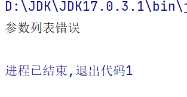

# 编译器的设计与实现

## 一、目标

设计和实现某一规模适中的语言的编译器，该编译器不仅涉及编译程序的各个阶段，而且也强调了编译的总体设计、各个阶段的接口安排等等

## 二、词法分析程序设计与实现

### 目的

​	建立一个词法分析器

1. 滤掉单词间的空格
2. 过滤注释
3. 识别关键字，用查关键字表的方法识别
4. 识别标识符
5. 处理数字
6. 拼由两个字符组成的运算符
7. 构造token
8. 打印源程序，边读入字符边打印

### 实现步骤

**（一）Error类**

//对于语法错误的处理类

> UML类图


**（二）Token**

//词法分析器最终的分析结果

> UML类图


**（三）Compiler**

//编译器

主要的变量成员有编译器所需要的全局变量、存放源程序的文件流、错误信息以及一个存放单个字符的词法单元类型的枚举类TokenType 

> UML类图


> 方法说明

getTokenType() *//用于判断一个单词是否在TokenType内，返回相应的对象*

contains() *//判断一个单词是否属于TokenType内的某个值，返回true或false*

readFile() *//用于读取文件内的源程序*

**（四）Lexer**

//词法分析器

将输入的源程序读入，跳过空格、制表符、换行符和注释，将每个单词封装为token，判断程序有无词法错误

> UML类图


> 方法说明

advance()

将指针指向源程序构成的字符串的下一个字符，并记录当前指针指向的字符值

skip_whitespace()

跳过空白符

_is_ident1()

如果输入字符作为标识符的第一个字符有效，则返回true。

_is_ident2()

如果输入字符作为标识符的非首字符有效，则返回true

number()

识别输入字符串中的(多位数)整数或浮点数，封装到token中并返回

read_punct()

从字符串中读取标点符号并返回相应的数字：

/* —— 4

// —— 3

== != <= >= —— 2

C 语言区域中被视为标点符号的 ASCII 字符 —— 1

其余情况 —— 0

get_next_token()

词法分析器的主要方法，对源程序组成的字符串逐字符进行扫描，每个单词封装为一个token.

首先使用skip_whitespace跳过空白符和换行符

如果当前字符为数字就调用number()方法

否则调用_is_ident1()方法判断该字符及后面的字符是否能够组成标识符或者是否属于TokenType内的关键字

否则调用read_punct()方法判断当前字符是否为标点符号，在内部对于read_punct()返回的不同数字分别做相应的处理

否则判断当前字符是否属于TokenType内的单个字符类型

gather_all_tokens()

内部循环调用get_next_token()方法，直到读取到文件的末尾，主要是用于测试。

### 单元测试

**测试程序**


**运行结果**

```java
value   type   width   lineno   column
int   TK_INT   3   1   4
main   TK_IDENT   4   1   9
(   TK_LPAREN   1   1   9
)   TK_RPAREN   1   1   10
{   TK_LBRACE   1   1   12
return   TK_RETURN   6   2   11
foo   TK_IDENT   3   2   15
(   TK_LPAREN   1   2   15
1   TK_INTEGER_CONST   1   2   17
,   TK_COMMA   1   2   17
2   TK_INTEGER_CONST   1   2   19
,   TK_COMMA   1   2   19
3   TK_INTEGER_CONST   1   2   21
,   TK_COMMA   1   2   21
4   TK_INTEGER_CONST   1   2   23
,   TK_COMMA   1   2   23
5   TK_INTEGER_CONST   1   2   25
,   TK_COMMA   1   2   25
6   TK_INTEGER_CONST   1   2   27
)   TK_RPAREN   1   2   27
;   TK_SEMICOLON   1   2   28
}   TK_RBRACE   1   3   1
int   TK_INT   3   5   4
main   TK_IDENT   4   5   9
(   TK_LPAREN   1   5   9
)   TK_RPAREN   1   5   10
{   TK_LBRACE   1   5   12
if   TK_IF   2   5   15
(   TK_LPAREN   1   5   15
1   TK_INTEGER_CONST   1   5   17
)   TK_RPAREN   1   5   17
then   TK_THEN   4   5   23
return   TK_RETURN   6   5   30
3   TK_INTEGER_CONST   1   5   32
;   TK_SEMICOLON   1   5   32
else   TK_ELSE   4   5   38
return   TK_RETURN   6   5   45
5   TK_INTEGER_CONST   1   5   47
;   TK_SEMICOLON   1   5   47
}   TK_RBRACE   1   5   48
null   TK_EOF   0   0   0

进程已结束,退出代码0

```

## 三、语法分析程序设计与实现

### 目的

​	建立一个语法分析器。

​	采用一遍扫描的方法，一边读取单词构造token,一边封装AST结点，构造抽象语法树。

### 实现步骤

**（一）ASTNodeType**

//抽象语法树结点基类

使用抽象语法树来描述程序代码整体的语法结构，语法树的每一个节点都代表着程序代码中的一个语法结构；AST不依赖于具体的文法，也不依赖于语言的细节。

> UML类图


> 子类说明

UnaryOp_Node *//**一元操作符结点*

If_Node *//**判断结点*

Return_Node *//**返回值结点*        

Block_Node *//**语句块结点*

BinaryOp_Node *//**二元操作符结点*

Assign_Node *//**赋值结点*

FunctionCall_Node *//**函数调用结点*

Num_Node *//**数字结点*

Var_Node *//**变量名结点*

Type_Node *//**类型结点（指的是变量的类型，比如int）*

VarDecl_Node *//**变量声明结点*

格式为：type_specification (indentifier ("=" expr)? ("," indentifier ("=" expr)?)*)? ";" ）

FormalParam_Node *//**形参结点* 

格式为： type_specification identifier

FunctionDef_Node *//**函数定义结点*

格式为：(type_specification identifier "(" formal_parameters? ")" block)

 **（二）Parser**

//语法分析器

内部调用词法分析器的get_next_token()方法对token流进行逐个遍历，将传入的token流构造成抽象语法树。

> UML类图


> 方法说明

`eat()`

比较当前token类型与传递的token类型，如果它们匹配，则略过当前token并将下一个令牌分配给this.current_token，否则引发异常

`parse()`

入口方法,因为传入的程序都是函数，无论是main函数还是其他自定义的函数，所以首先调用function_definition();当一段程序在函数定义部分之外还有token,并且这个token还不是代表程序结束的EOF，则代表程序出错。

`function_definition()`

function_definition= type_specification identifier "(" formal_parameters? ")" block

对接下来的token按照如上格式进行处理，将其定义为一个FunctionDef_Node并返回;在函数的参数部分调用了formal_parameters()，返回的是一个List<ASTNodeType>类型的参数列表;后面的部分是一个函数体，调用了block()。

`formal_parameters()`

formal_parameters = formal_parameter ("," formal_parameter)*

参数列表的格式如上，以“(”开始，以“)”结束，中间的参数以“,”作为间隔，所以在读取到第一个左括号token之后，只要未读到右括号token，参数列表的构建就还未完成，在通过调用formal_parameter()方法读取到第一个formal_parameter后进入循环，读到“,”就eat()掉，接着递归调用formal_parameters()方法，直到返回所有的formal_parameters。

`formal_parameter()`

formal_parameter = type_specification identifier

参数格式如上，由类型声明+变量名构成，其中对于表示类型声明结点的type_node的构造调用了type_specification()方法，而对于变量结点parameter_node的构造则直接实例化了一个Var_Node将当前的token封装进去。 

`type_specification()`

type_specification = int

对于变量类型的声明，只支持int一种类型，当正在处理的token的类型为TK_INT，则直接使用当前token实例化一个Type_Node并返回。

`block()`

block = "{" compound_statement "}"

函数体的格式如上，由{}包裹着中间一系列的复合语句，复合语句部分调用compound_statement()进行构建。

`compound_statement()`

compound_statement = (variable_declaration | statement)*

复合语句由变量声明（赋值）语句或者是一串声明结点的语句构成，当第一个token的类型为int时，说明是变量声明语句，则调用variable_declaration()方法，否则就调用add()方法加入List<ASTNodeType>类型的 statement_nodes之中。

`variable_declaration()`

variable_declaration = type_specification (identifier ("=" expr)? ("," identifier ("=" expr)?)*)? ";"

变量声明语句的形式如上，变量有可能只声明不赋值，也有可能同时声明多个变量，根据这些情况对token进行处理，并将除“，”和“；”以外的token封装到List<ASTNodeType> 类型的variable_nodes中。

`statement()`

statement = expression-statement

​     | "return" expression-statement

​      | block

​      | "if" "(" expression ")" statement ("else" statement)?

statement有这样几种情况：

1.直接是运算表达式；

调用expression_statement()方法

2.返回语句；

如果token的类型为return，就说明是返回语句，直接将return后面的token调用expression_statement()方法的结果封装到Return_Node内

3.一个新的语句块；

如果token的类型为“{”，调用block()方法

4.判断语句；

如果token的类型为if，则说明为判断语句，判断语句的判断条件部分调用expression()方法，判断条件后需要执行的语句则调用statement()方法。

`expression_statement()`

expression-statement = expression? ";"

每个运算表达式之间用“；”分隔，遇到“；”就调用eat()方法，否则就调用expression()方法。

`expression()`

expression = assign

`assign()`

assign = equality ("=" assign)?

有两种情况，一种是判断，直接调用equality()方法；一种是直接赋值（token的类型为“=”）,那就将指针指向下一个token，递归调用assign()。

`equality()`

equality = relational ("==" relational | "! =" relational)*

首先调用relational()处理比较关系的情况，然后处理“==”和“!=”的情况，当token的类型为“==”或者“!=”时，就调用eat()方法将指针指向下一个token，然后将后面调用relational()的结果封装到二元操作结点BinaryOp_Node中。

`relational()`

relational = add_sub ("<" add_sub | "<=" add_sub | ">" add_sub | ">=" add_sub)*

首先调用add-sub()方法处理加减乘除运算，然后根据token的类型逐个处理“<”，“>”，“>=”和“<=”四种情况，将后面的token封装到BinaryOp_Node内，直到循环结束。

`add_sub()`

add-sub = mul_div ("+" mul_div | "-" mul_div)*

算术表达式首先调用mul_div()方法处理乘除运算，然后分别处理加减运算，将加减符号后面的token封装到BinaryOp_Node中。

`mul_div()`

mul_div = unary ("*" unary | "/" unary)*

首先调用unary()方法处理一元运算的情况，然后分别处理乘除运算，将乘除符号后面的token封装到BinaryOp_Node中。

`unary()`

unary = ("+" | "-") unary

​    | primary

有两种情况，第一种是加减操作符后面跟着一元运算表达式（自增、自减）：调用eat()方法将指针指向下一个token，然后递归调用unary()方法，讲结果封装到UnaryOp_Node内；第二种基本语法单元直接调用primary()方法。

`primary()`

primary = "(" expr ")" | identifier args? | num

args = "(" (assign ("," assign)*)? ")"

primary的形式如上，根据不同的情况分别调用相应的方法进行处理。

### 单元测试

由于语法分析器的实验结果不便打印，所以这里只测试了出现语法错误的地方

**测试程序**


**运行结果**



## 四、语义分析与目标代码生成程序设计与实现

### 目的

​	完成解释执行目标程序的部分，包括语义分析器与代码生成器

### 实现步骤

**（一）Symbol**

//基本符号类型，用于构造符号表

> UML类图


**（二）ScopedSymbolTable**

//作用域符号表

> 方法说明

insert()// 在符号表中插入一个符号

lookup()// 根据已构造的作用域符号表，对当前变量递归地沿着链向上查找名称，判断作用域是否正确

**（三）NodeVisitor**

//用来遍历AST

> UML类图


> 方法说明

`visit()`

利用java的反射机制，根据传入的AST结点的类型调用相应的visit方法，例如传入的node的指针虽然是ASTNodeType类型，但其实际指向的对象类型是FunctionDef_Node，那么visit()方法就在当前调用visit()方法的对象的类中寻找visit_FunctionDef_Node()方法，如果有就返回调用visit_FunctionDef_Node()方法的结果，否则就调用generic_visit()方法处理没有对应方法的异常

**（四）SemanticAnalyzer**

//语义分析器

遍历AST，提供对于不同AST结点的visit方法。主要用于构造符号表，同时判断程序是否存在语义错误。

> UML类图


> 方法说明

`semantic_analyze()`

遍历由语法分析器构造的抽象语法树，从而构造符号表

`visit_Block_Node()`

构造语句块作用域范围内的符号表

`visit_Var_Node()`

内部调用ScopedSymbolTable类的lookup()方法，检查当前变量是否已经被声明

`visit_VarDecl_Node()`

创建变量符号并将其加入到当前作用域范围的符号表中

`visit_FormalParam_Node()`

创建参数符号并将其加入到当前作用域范围的符号表中

`visit_FunctionDef_Node()`

构造函数作用域范围内的符号表

其他的visit方法内不需要构造符号表，只需要根据对应AST结点的特点调用visit()方法 [例如BinaryOp_Node既有左结点又有右结点，所以visit_BinaryOp_Node内先调用this.visit(node.left)方法，再调用this.visit(node.right)方法]

**（五）Codegenerator**

//代码生成器

逻辑与语义分析器类似，同样遍历AST，调用相应的visit方法，并打印出相应的汇编指令

> UML类图


**方法说明**

`align_to()`

//将' n '四舍五入到' align '的最接近倍数。如Align_to(5,8)返回8,Align_to(11,8)返回16

`code_generate()`

//遍历AST以打印出程序集

### 单元测试

**测试程序**


**测试结果**

```java
ENTER scope:foo
ENTER scope:fooblock2
LEAVE scope:fooblock2
LEAVE scope:foo
ENTER scope:main
ENTER scope:mainblock2
LEAVE scope:mainblock2
LEAVE scope:main
ENTER scope:main
ENTER scope:mainblock2
LEAVE scope:mainblock2
LEAVE scope:main
ENTER scope:main
ENTER scope:mainblock2
LEAVE scope:mainblock2
LEAVE scope:main
ENTER scope:main
ENTER scope:mainblock2
LEAVE scope:mainblock2
LEAVE scope:main
ENTER scope:main
ENTER scope:mainblock2
LEAVE scope:mainblock2
LEAVE scope:main
ENTER scope:main
ENTER scope:mainblock2
LEAVE scope:mainblock2
LEAVE scope:main
ENTER scope:main
ENTER scope:mainblock2
LEAVE scope:mainblock2
LEAVE scope:main

进程已结束,退出代码0

```

